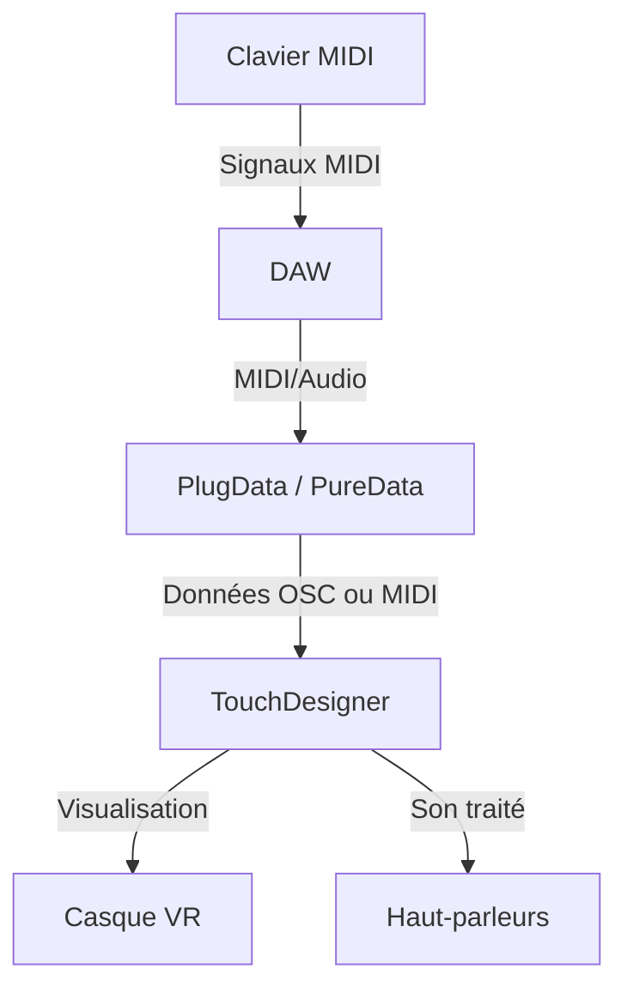
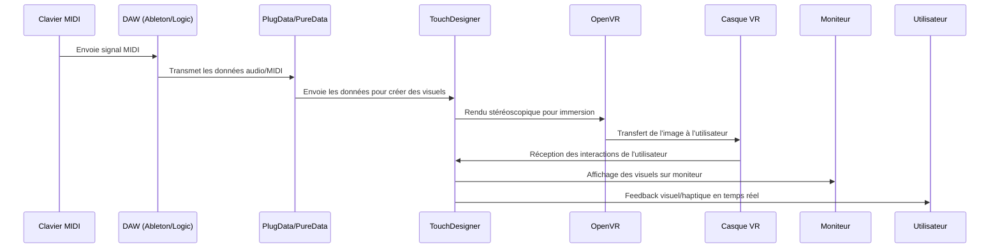

# Vizua

[Précédement Wave3D](https://jejed8.github.io/wave3d/)

## Concept

L'expérience est une installation immersive où l'utilisateur joue sur un clavier MIDI et voit des visuels dynamiques se déployer autour de lui en réalité virtuelle. Chaque note déclenche des animations spectaculaires qui réagissent en temps réel, créant un spectacle audiovisuel captivant et interactif.

<!--  -->

### Inspiration

Le projet s'inspire des "Music Visualizers", populaires sur les lecteurs de médias audio des appareils électroniques, particulièrement entre les années 2000 et le début des années 2010.

L'idée est de moderniser les visualiseurs de musique en intégrant la réalité virtuelle, offrant ainsi une expérience plus immersive pour contempler un visualiseur audio.

#### Exemples :

- [Apple iTunes Classic Visualizer](https://www.youtube.com/watch?v=i4JbAm7awCc&list=PLPF1dVJ5LqyQi0A6NYr3UD-zhF91ySM_2&index=2)
- [Xbox 360 music visualizer](https://www.youtube.com/watch?v=tjI4dYWsFbM)

## Scénario interactif

---

## Devis

| Devis pour l'installation immersive Vizua |
|-------------------------------------------|
| **Équipement**                          | **Description**                                                                             | **Prix estimé**    |
|----------------------------------------|---------------------------------------------------------------------------------------------|--------------------|
| Écran (Moniteur)                       | Écran pour afficher la vue en VR pour les spectateurs.                                      | 270,00 CAD         |
| Matériel pour l'installation physique  | Supports et fixations pour maintenir l'équipement en place et faciliter l'agencement.        | 135,00 CAD         |

| **Équipement fourni par l'école pour l'installation immersive Vizua** |
|---------------------------------------------------------------------|
| **Équipement**                          | **Description**                                                                         |
|----------------------------------------|-----------------------------------------------------------------------------------------|
| Haut-parleurs surround x4              | Système de son surround pour une expérience immersive complète.                         |
| Console de son                         | Console permettant de gérer et diriger le son vers les haut-parleurs.                   |
| Écran (Moniteur)                       | Écran pour afficher la vue en VR pour les spectateurs.                                  |
| Chariot avec roulette                  | Chariot pour la mobilité de l'installation et pour héberger les équipements.            |
| Câbles et connecteurs divers           | Câbles HDMI, USB, audio, alimentation et autres connecteurs nécessaires pour le montage.|
| Support pour Casque VR (optionnel)     | Support pour ranger et organiser le casque VR de manière pratique.                      |
| Matériel pour l'installation physique | Supports et fixations pour maintenir l'équipement en place et faciliter l'agencement.   |

---

### Location / emprunt

- 🎹 Clavier MIDI
- 🎛️ Console audio (facultative si tout est géré par l'ordinateur).
- 🔊 Haut-parleurs (minimum 4 pour un son surround).
- 💻 Ordinateur
- 🥽 Casque VR
- 🖥️ Moniteur externe (pour le public).
- 🖥️ DAW: Ableton Live ou Logic Pro.
- 🔧 PlugData ou PureData : Traitement MIDI/audio.
- 🌀 TouchDesigner : Visualisations interactives.
- 🔗 Oculus Software : Gestion du casque VR.

## Plantation

Comme le côté visuel de l'expérience se situe en réalité virtuelle, cela permet à l'installation d'être facilement déplacer.

## Zone de plantation dans le studio

#### Vue de coté

#### Vue de dessus

---

## Composantes

**Clavier MIDI:**

- C’est l’interface principale pour l’utilisateur.
- Permet de jouer des notes et des accords qui génèrent à la fois des sons (via le DAW) et des animations visuelles (via PlugData/PureData et TouchDesigner).
- Envoie des signaux MIDI à l’ordinateur pour traitement.

**Haut-parleurs :**

- Diffusent le son produit par le DAW pour créer une expérience immersive.

**Console de son :**

- Permet d'envoyer les données sonore vers les hauts-parleurs,
- Gère le volume,

**Haut-parleurs :**

- Permet le son à l'installation,

  **Supports pour haut-parleurs**

  -Placés stratégiquement pour offrir une diffusion sonore équilibrée.

**Ordinateur :**

- C’est le cœur de l’installation.
- Gère tous les logiciels et traite les signaux MIDI/audio.
- Génère les visuels dans TouchDesigner en réponse aux données MIDI.
- Transmet les visuels au casque VR et les sons aux haut-parleurs.

**Moniteur :**

- Reçoit les données vidéo de l'ordinateur,
- Permet aux spectateur de participer à l'installation avec une recopie d'écran du casque VR,

**Casque VR :**

- Permet une immersion totale en affichant les visuels générés par TouchDesigner dans un environnement virtuel.
- Suit les mouvements de la tête de l’utilisateur pour ajuster les perspectives visuelles.

**Chariot :**

- Aide à la mobilité de l'installation,
- Abrites les composantes (ordinateur, console de son, moniteur),

**Câblage :**

Connecte toutes les composantes entre elles (clavier, casque, haut-parleurs).
Assure une alimentation stable.

---

## Synoptique

### Schéma

---

### Description de la synoptique

#### Entrée

- **Clavier MIDI** : Envoie des signaux MIDI au DAW.
- **DAW (Digital Audio Workstation)** :
  - Reçoit le signal MIDI.
  - Modifie les sons (EQ, effets, etc.).
  - Envoie les données audio/MIDI à TouchDesigner.

#### Création Visuelle

- **TouchDesigner** :
  - Reçoit les données MIDI/audio.
  - Crée des visuels dynamiques basés sur les notes jouées.
  - Intègre des éléments 3D et de l'instancing pour des visuels complexes.

#### Rendu VR

- **OpenVR CHOP/TOP** :
  - Configure l'environnement de rendu stéréoscopique.
  - Relie les mouvements du casque VR et des contrôleurs à la caméra virtuelle et aux interactions visuelles.
- **Scène 3D** :
  - Adapte l'espace visuel pour l'immersion totale.
  - Synchronise les éléments visuels avec les mouvements et les interactions de l'utilisateur.

#### Interactions et Retours

- **Contrôleurs VR** :
  - Permettent à l'utilisateur de manipuler et interagir avec les visuels.
  - Envoient des signaux à TouchDesigner pour déclencher des animations ou modifier les éléments visuels.
- **Feedback visuel et haptique** :
  - Affiche des réponses visuelles et, si possible, des retours haptiques via les contrôleurs.

#### Résumé du Flux

**Clavier MIDI ➔ DAW ➔ Analyse par PyTorch ➔ Transmission OSC/WebSocket ➔ TouchDesigner ➔ Rendu VR (OpenVR).**

**Interaction utilisateur (contrôleurs) ➔ TouchDesigner ➔ Feedback en temps réel.**

### Liste des logiciels

| Logiciel                                     | Description Technique                                                                            |
| -------------------------------------------- | ------------------------------------------------------------------------------------------------ |
| TouchDesigner                                | Génère des visuels interactifs et les rend en temps réel dans un environnement VR.               |
| DAW (Ableton/Logic)                          | Capture, modifie et traite les signaux MIDI/audio pour enrichir l'expérience sonore.             |
| PlugData ou PureData                         | Traduit les signaux MIDI/audio en paramètres visuels exploitables par TouchDesigner.             |
| OpenVR                                       | Permet l'intégration et le rendu stéréoscopique de la scène VR et gère le suivi des mouvements.  |
| Oculus Software                              | Établit la connexion et le suivi du casque Oculus avec le PC pour une immersion VR optimale.     |
| OSC (Open Sound Control)                     | Transmet les données MIDI/audio entre le DAW, PlugData/PureData, et TouchDesigner en temps réel. |
| MIDI Monitor (macOS) ou MIDI-OX (Windows)    | Visualise les signaux MIDI pour vérifier la configuration et détecter les erreurs.               |
| Virtual Audio Cable (ou équivalent)          | Permet de router l’audio entre différents logiciels si nécessaire.                               |
| Soundflower (macOS) ou Voicemeeter (Windows) | Gère les flux audio pour un monitoring précis et avancé.                                         |

#### Communication

